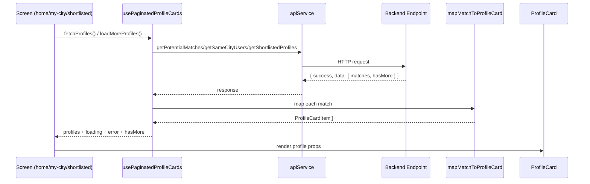

# Matrimonial App Frontend Architecture

This document summarizes the current Expo frontend architecture and the key runtime flows.

## 1) High-Level Module View

```mermaid
flowchart LR
  A[Expo Router Screens] --> B[Reusable Components]
  A --> C[Custom Hooks]
  A --> D[Service Layer]
  D --> E[Backend APIs]
  A --> F[AsyncStorage]
  C --> D
  C --> G[Utilities]
  B --> D

  subgraph Screens
    A1[app/(tabs)/home.tsx]
    A2[app/(tabs)/my-city.tsx]
    A3[app/shortlisted.tsx]
    A4[app/profile/[id].tsx]
    A5[app/chat/[id].tsx]
  end

  subgraph Shared
    B1[components/ProfileCard.tsx]
    C1[hooks/usePaginatedProfileCards.ts]
    G1[utils/profileCardMapper.ts]
  end

  A1 --> B1
  A2 --> B1
  A3 --> B1
  A1 --> C1
  A2 --> C1
  A3 --> C1
  C1 --> G1
```

## 2) Navigation Structure

```mermaid
flowchart TD
  Root[app/_layout.tsx Stack] --> Tabs[app/(tabs)/_layout.tsx Drawer/Tabs]
  Root --> ProfileDetail[app/profile/[id].tsx]
  Root --> ChatDetail[app/chat/[id].tsx]
  Root --> Shortlisted[app/shortlisted.tsx]

  Tabs --> Home[(tabs)/home]
  Tabs --> MyCity[(tabs)/my-city]
  Tabs --> Matches[(tabs)/matches]
  Tabs --> Requests[(tabs)/requests]
  Tabs --> Profile[app/profile.tsx]
  Tabs --> Settings[app/settings.tsx]
```

## 3) Profile List Fetch Flow (Home / My City / Shortlisted)



## 4) Interest + Shortlist + Chat Action Flow

```mermaid
flowchart TD
  PD[Profile Detail / ProfileCard Action] --> IS{Interest Status?}
  IS -->|none| Send[Send Interest]
  IS -->|pending received| AcceptReject[Accept / Reject]
  IS -->|pending sent| Cancel[Cancel Interest]
  IS -->|accepted| Message[Open Message]

  Send --> API1[apiService.sendInterest]
  AcceptReject --> API2[apiService.acceptInterest / rejectInterest]
  Cancel --> API3[apiService.cancelInterest]

  PD --> Star{Shortlisted?}
  Star -->|No| AddSL[apiService.addToShortlist]
  Star -->|Yes| RemoveSL[apiService.removeFromShortlist]

  Message --> Conv[Resolve conversationId]
  Conv --> Chat[router.push chat/[conversationId]]
```

## 5) Shared Standards Adopted

- List-based profile screens use `usePaginatedProfileCards` for pagination, load-more, error, and response normalization.
- Match-to-card transformation is centralized in `utils/profileCardMapper.ts`.
- `ProfileCard` remains the single reusable surface for interest/shortlist interactions in list UIs.
- `app/profile/[id].tsx` handles detail-only actions (premium limit modal, accepted-only message routing).

## 6) TODO (Frontend)

- Replace remaining `any` in screen/hook DTO usage with shared API response types.
- Add stale-time cache in `usePaginatedProfileCards` to avoid repeated fetches on quick tab switch.
- Add unit tests for mapper and list hook behavior (pagination append/reset/error states).
