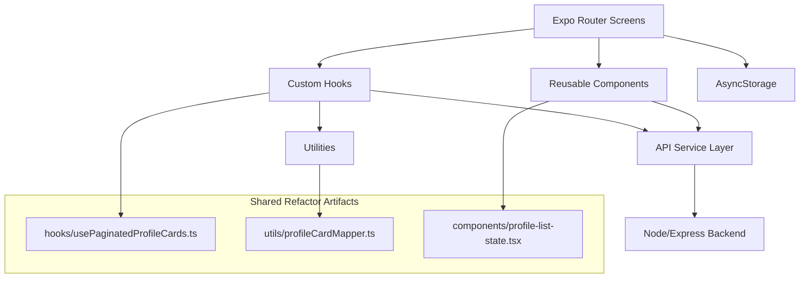
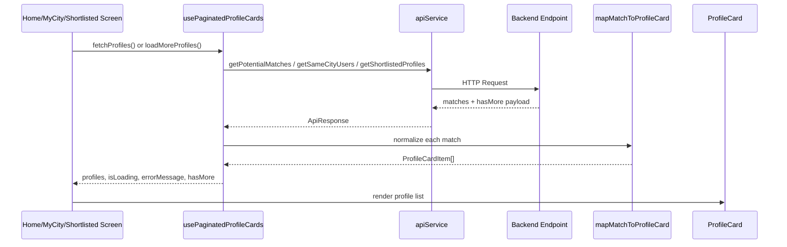

# Frontend Mermaid - matrimonialApp

This file provides a quick visual map of the React Expo frontend architecture.

## App Layers



## List Screen Flow



## Interaction Flow (Interest / Shortlist / Message)

```mermaid
flowchart LR
  UserAction[User taps action] --> CardOrDetail[ProfileCard or profile/[id]]
  CardOrDetail --> InterestAPI[Interest APIs]
  CardOrDetail --> ShortlistAPI[Shortlist APIs]
  CardOrDetail --> ChatGate{Interest accepted?}
  ChatGate -->|Yes| ResolveConversation[Resolve conversationId]
  ResolveConversation --> OpenChat[Open chat/[conversationId]]
  ChatGate -->|No| BlockMessage[Show restriction / no navigation]
```

## TODO Notes

- TODO: Replace remaining loose response typing with shared DTO interfaces.
- TODO: Move hardcoded list-state colors to centralized theme tokens.
- TODO: Add tests for `usePaginatedProfileCards` and `profileCardMapper`.
